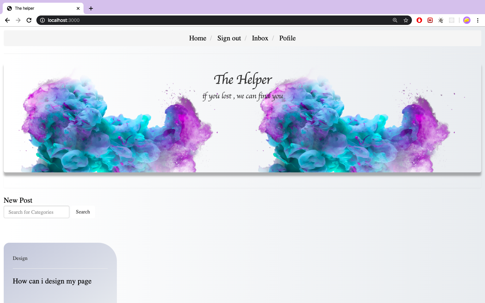
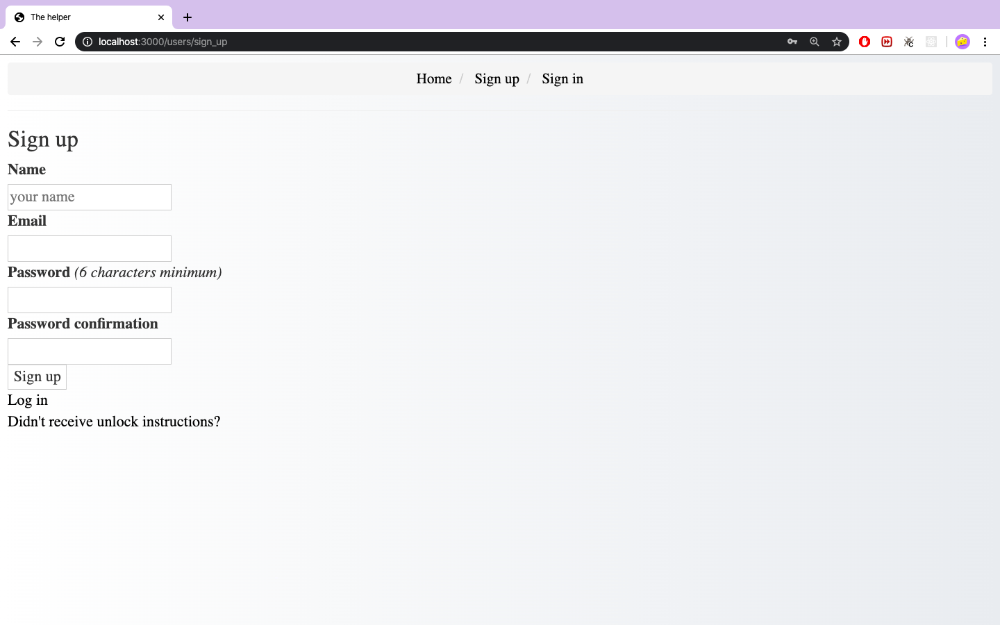
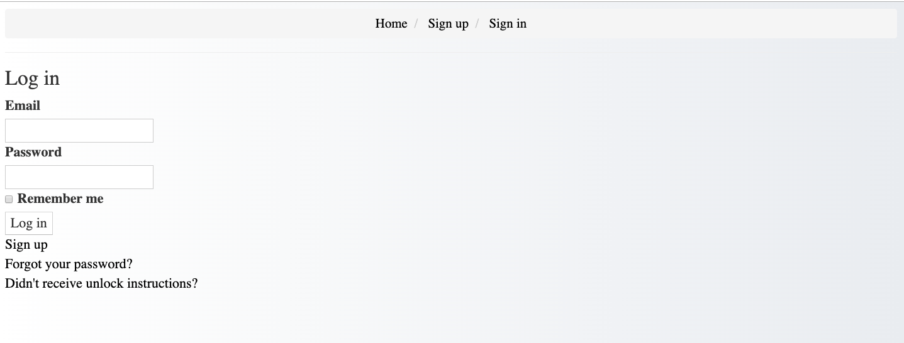
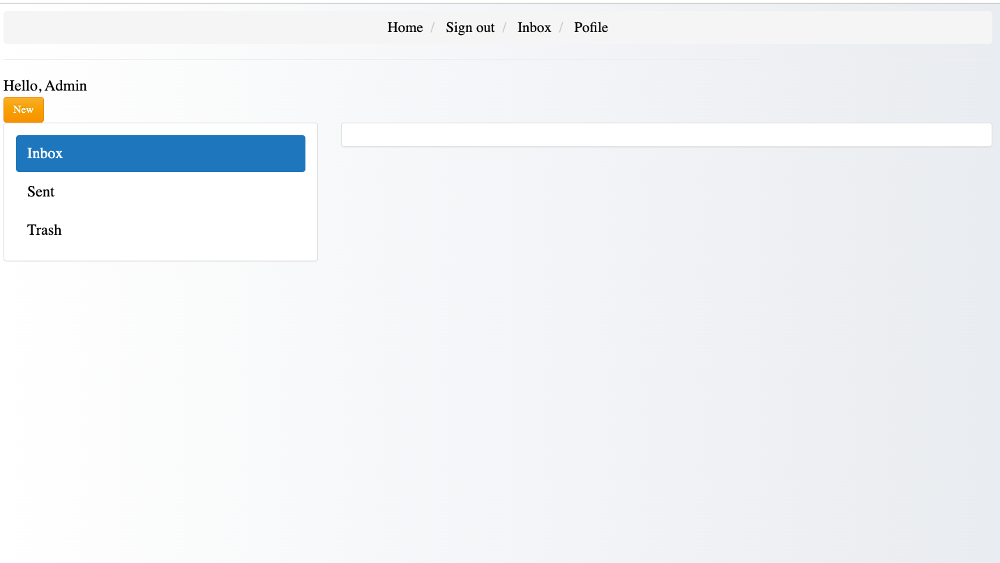
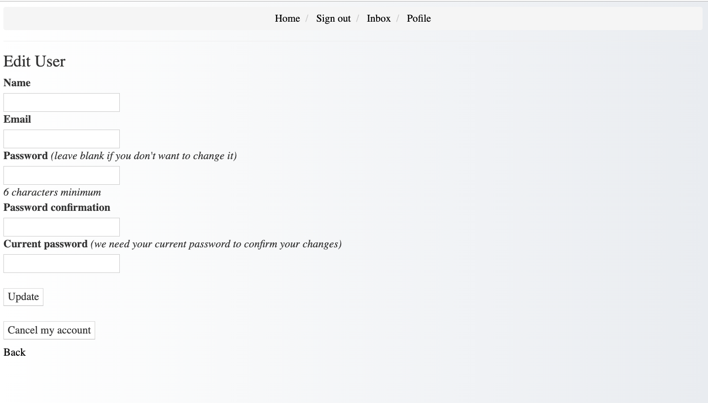

# final Project

### The Helper:

### Techniques used :

```python
- 'Ruby'
- 'rails'
- 'PostgreSQL'
- 'bootstap'
- 'Visual Studio Code'
```

### wireframes







### User stories :

```python
- As a user , I sign in and sign out.
- As a user , I log in.
- As a user , I edit my profile.
- As a user , I can add new post .
- As a user , I add comments on the post .
- As a user , I can send and receive messages.
- As a user , I can retrieve messages.
- As a Admin , I can delete and edit the posts.
- As a Admin , I can delete the comments.
```

### add next :

```ruby
- The user who created the post can deleted and edit it
- Delete messages wothout retrieval
- Unique user
```

### reference :

```python
- https://github.com/mailboxer/mailboxer
https://github.com/heartcombo/devise#getting-started
https://edgeguides.rubyonrails.org/index.html
https://www.w3schools.com/default.asp

```
